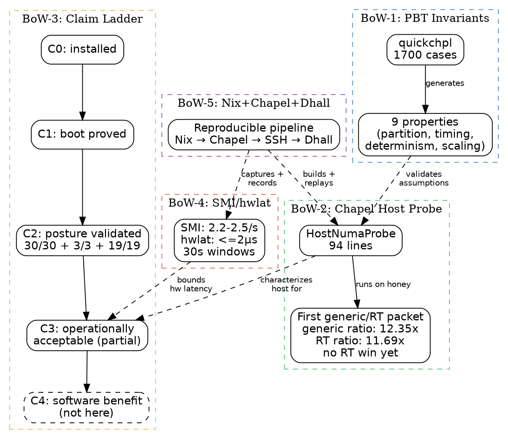

# Bodies of Work: Chapel + PBT Development Flow

Date: 2026-04-25

This document identifies distinct publishable bodies of work where the Chapel
language and property-based testing (PBT via `quickchpl`) serve as the
development flow for measurable, auditable host-characterization work on the
Dell T7810.

Focus: the development methodology and what it measured, not the downstream
application goals. Each body stands alone as an incremental publication.

Companion: [`chapel-pbt-publishing-roadmap-2026-04-25.md`](chapel-pbt-publishing-roadmap-2026-04-25.md)
for the readiness ladder and claim boundaries.

Status note: this is a bodies-of-work map, not a live call-for-papers calendar.
Track current deadlines and private draft strategy in Linear before submitting
anything externally.

## Bodies of Work

### BoW-1: PBT-Hardened Timing Invariants for Host Characterization

**Shape:** IEEE-style short paper or methods note (4-6 pages).

**Thesis:** Property-based testing in Chapel catches timing-budget and
partitioning violations before they reach live host measurements, making the
host-characterization claim surface formally auditable.

**Source evidence already in repo:**

| Property tested | Generator range | Trials | Module |
| --- | --- | --- | --- |
| Partition coverage = channel total | 0-512 ch, 1-16 groups | 200 | `TestHostNumaTiming.chpl` |
| Partitions contiguous and exact | 0-512 ch, 1-16 groups | 200 | `TestHostNumaTiming.chpl` |
| Synthetic signal deterministic | 0-256 samples, seeds 0-10000 | 200 | `TestHostNumaTiming.chpl` |
| Timing stats ordered and non-negative | 1-128 samples, 0-5s | 200 | `TestHostNumaTiming.chpl` |
| Timing stats scale linearly | 1-128 samples, factor 0.1-10x | 100 | `TestHostNumaTiming.chpl` |
| Monotonic timestamps round-trip to intervals | 1-128 intervals, 0-50ms | 200 | `TestTimingProofs.chpl` |
| Exact periodic timestamps satisfy budget | 2-256 samples, 0.5-20ms period | 200 | `TestTimingProofs.chpl` |
| Bounded jitter respects matching budget | 2-256 samples, 4-20ms period | 200 | `TestTimingProofs.chpl` |
| Scaling intervals preserves conformance | 2-256 samples, factor 0.1-10x | 100 | `TestTimingProofs.chpl` |

Total encoded by the checked-in source: 9 property tests, 1700 generated test
cases across 2 modules.

**Figure opportunities:**

1. **Table (IEEE):** Property test matrix above, with pass/fail column from
   live run. This is the centerpiece.
2. **Graphviz:** Module dependency graph:
   `quickchpl` → `TestTimingProofs` → `TimingProofs` → `HostNumaTiming`;
   `quickchpl` → `TestHostNumaTiming` → `HostNumaTiming`.
3. **Graphviz:** `TimingBudget` conformance decision tree:
   period → jitter bound → latency bound → conforms/rejects.
4. **Code listing (IEEE):** `timingConforms` function (12 lines) as the formal
   conformance predicate.

**Claim this paper can make after a fresh recorded test run:**
PBT validated 9 invariants across 1700 generated cases before any live host
measurement. The invariants cover partition coverage, contiguity, determinism,
timing-stats ordering, linear scaling, monotonic round-trip, exact-periodic
conformance, bounded-jitter conformance, and scaling-preserving conformance.

**Claim it can make today from source inspection:**
The checked-in Chapel PBT suite defines those 9 invariants and trial counts.

**Claim it must NOT make:**
PBT proved the host is faster. PBT replaced empirical measurement. PBT is a
benchmark.

---

### BoW-2: Chapel as Host-Characterization Language on Legacy Dual-Socket Xeon

**Shape:** Technical blog post or conference experience report (3-5 pages).

**Thesis:** Chapel's `forall` parallelism, locale model, and typed records
express dual-socket NUMA-aligned host probes concisely enough to serve as a
host-characterization DSL for legacy workstation research.

**Measured evidence already in repo:**

| Metric | Generic lane (2026-04-25) | RT lane (2026-04-25) | Source |
| --- | --- | --- | --- |
| Chapel version | 2.8.0 | 2.8.0 | `honey-rt-smi-hwlat-chapel-series-2026-04-25.md` |
| Kernel | `6.19.5-7.xr.el10` | `6.19.5-rt1-8.xr.el10` | probe output |
| Locales | 1 | 1 | probe output |
| Sublocales | 0 (flat model, expected) | 0 (flat model, expected) | probe output |
| Partitions | 2 x 50 channels | 2 x 50 channels | probe output |
| Timing conforms | true | true | probe output |
| Serial reduction | 0.022323s | 0.022533s | probe output |
| Parallel reduction | 0.001807s | 0.001927s | probe output |
| Characterization throughput ratio | 12.3536x | 11.6933x | serial / parallel |
| Host cores | 32 (2 x E5-2630 v3) | 32 (2 x E5-2630 v3) | `lscpu` |
| NUMA nodes | 2 (OS-visible) | 2 (OS-visible) | `numactl --hardware` |

**Figure opportunities:**

1. **Packet figure:** First paired generic/RT packet summary:
   `docs/publication/figures/bow2-first-generic-rt-packet.dot`.
2. **CSV-backed table:** SMI, `hwlat`, and Chapel metrics:
   `docs/publication/data/honey-rt-smi-chapel-packet-2026-04-25.csv`.
3. **Bar chart:** Serial vs parallel reduction time for the first paired
   generic and RT packet. Label this as characterization throughput, not
   application performance.
4. **Graphviz:** Chapel module architecture: `HostNumaProbe` → uses
   `HostNumaTiming` (partitioning, stats) + `TimingProofs` (budget,
   conformance). Annotate with line counts.
5. **Table (IEEE):** Host context table: CPU, sockets, NUMA nodes, kernel,
   cmdline posture, tuned profile.
6. **Graphviz:** Probe execution flow: `partitionChannels` → generate
   synthetic data → serial reduction → `forall` parallel reduction → timing
   proof check → `Conforms: true`.
7. **Listing:** `HostNumaProbe.chpl` is small enough to present as a complete,
   reproducible program listing.

**Claim this paper can make:**
A small Chapel program characterizes a dual-socket Xeon host with typed
partitioning, NUMA-aligned synthetic workload, and timing-budget conformance,
producing replayable generic and RT lane results on commodity hardware.

**Claim it must NOT make:**
Chapel sees NUMA sublocales (flat model returns 0 by design). The throughput
ratio is not an application benchmark or proof of RT benefit. The Chapel probe
does not replace `numactl` or kernel-side NUMA management.

---

### BoW-3: Kernel Posture Validation Through the C0-C4 Claim Ladder

**Shape:** Blog post series (2-3 posts) or conference poster.

**Thesis:** A five-level claim ladder (C0: installed → C4: software benefit)
prevents premature optimization claims and forces each level to cite its own
measured evidence before the next level is asserted.

**Measured evidence already in repo:**

| Level | Claim | Status on honey | Evidence |
| --- | --- | --- | --- |
| C0 | RT package installed | Yes | `linux-xr` RPM, `rpm -q` |
| C1 | RT boot proved | Yes | `uname -v` PREEMPT_RT, `/sys/kernel/realtime = 1` |
| C2 | Host posture validated | Yes | base 30/30, RT overlay 3/3, cmdline 19/19 |
| C3 | Operationally acceptable | Partial | RT recovery ~120s vs generic ~55s; SMI 16/10s; hwlat 0μs |
| C4 | Software benefit proved | Not here | Belongs to XoxdWM |

**Figure opportunities:**

1. **Graphviz state diagram:** C0 → C1 → C2 → C3 → C4 with gates
   (evidence required at each transition). Color by current status:
   green (proved), yellow (partial), gray (not here).
2. **Table (IEEE):** The status table above, with evidence-source column
   linking to capture files.
3. **Graphviz:** Authority graph: which repo owns which claim level.
   `linux-xr` → C0, `Dell-7810` → C1/C2/C3, `XoxdWM` → C4.
4. **Bar chart:** Kernel validation pass rates: 30/30 base, 3/3 RT overlay,
   19/19 cmdline. Stack by category.
5. **Timeline:** Claim progression over dates (April 22-25, 2026): which
   levels were established when, and what evidence was captured at each point.

**Claim this paper can make:**
The ladder prevented three specific premature claims: (a) "RT is the default
lane" when only C0 was established, (b) "host is optimized" when C3 recovery
time was still unacceptable, (c) "downstream software benefits" when C4
belongs to a different repo entirely.

---

### BoW-4: SMI Characterization and Bounded Hardware Latency on Dell T7810

**Shape:** Measurement note or poster (2-3 pages).

**Thesis:** Systematic SMI counting and hardware latency tracing on a legacy
dual-socket Xeon establish bounded baseline evidence before RT kernel claims
are made.

**Measured evidence already in repo:**

| Metric | BIOS A02 (historical) | BIOS A34 generic | BIOS A34 RT | Source |
| --- | --- | --- | --- | --- |
| SMI count / interval | ~22/30s (0.73/s) | 73-74/30s (2.4-2.5/s) | 65-74/30s (2.2-2.5/s) | `smi-validate-*.txt` |
| Worst hwlat | 2523 us | 2 us (tracefs) | 2 us (tracefs) | captures |
| Boot SMI accumulation | ~9959 | not measured | not measured | baseline |
| Cross-socket asymmetry | Yes (socket 1 worse) | not measured | not measured | baseline |
| usbemu=disable effect | N/A | no change | no change | captures |

**Figure opportunities:**

1. **Table (IEEE):** The SMI comparison table above.
2. **Bar chart:** SMI rate comparison across BIOS versions and kernel lanes.
3. **Histogram:** hwlat distribution from tracefs samples. The current short
   windows are too sparse for distribution claims.
4. **Graphviz:** SMI measurement pipeline: `smi-validate` script →
   `/dev/cpu/*/msr` → count → rate → evidence file → Dhall record.
5. **Annotation:** Cross-socket asymmetry diagram showing PCH locality to
   socket 0, explaining why socket 1 has worse latency characteristics.

**Gap for stronger publication:** The repo now has repeated 30s windows on
both generic and RT lanes, but the sample count is still too small for a
standalone measurement claim. Longer repeated runs would make this a
standalone note. Without them, this body works better as a section within
BoW-2 or BoW-3.

---

### BoW-5: Reproducible Host Probes via Nix + Chapel + Dhall

**Shape:** Blog post on developer workflow / reproducibility (1500-2500 words).

**Thesis:** The combination of Nix flakes (compiler reproducibility), Chapel
(probe language), Dhall (machine-readable evidence records), and `just` recipes
(turnkey execution) creates a host-characterization pipeline where every result
is replayable from source.

**Measured evidence already in repo:**

| Pipeline stage | Tool | Artifact |
| --- | --- | --- |
| Compiler sourcing | Nix flake + `chapel-2.8.0` package | `nix/packages/chapel.nix` |
| Probe build | `just chapel-host-capture-live-on-target` | `HostNumaProbe` binary |
| Live execution | SSH to `honey`, run probe | `chapel-host-probe-generic-2026-04-25.txt`, `chapel-host-probe-rt-2026-04-25.txt` |
| Machine-readable record | Dhall projection | `honey-chapel-host-probe-generic-2026-04-25.dhall`, `honey-chapel-host-probe-rt-2026-04-25.dhall` |
| Turnkey replay | Store-prebuilt target path | `chapel-host-probe-*-2026-04-25.txt` |
| PBT validation | `just chapel-host-test` | 9 properties, 1700 cases |

**Figure opportunities:**

1. **Graphviz:** End-to-end pipeline diagram: Nix flake → Chapel compiler →
   `HostNumaProbe.chpl` → SSH to honey → probe output → Dhall record →
   evidence file. Annotate each edge with the `just` recipe name.
2. **Table:** Pipeline stage table above.
3. **Side-by-side listing:** Generic vs RT output showing the same probe and
   schema under different kernel lanes, with no RT improvement claim.
4. **Graphviz:** Compiler sourcing decision tree: preferred external → sibling
   repo → Dell-local fallback → on-target build.

---

## Cross-Body Figure: The Development Flow

This graphviz diagram spans all five bodies of work and shows how the
development flow connects them:

## Working Schedule Proposal

This schedule is an internal sequencing proposal. It is not a venue-deadline
calendar.

| Target | Body | Shape | Effort | Dependencies |
| --- | --- | --- | --- | --- |
| May 2026 | BoW-5 | Blog post | 1 day writing | None; pipeline is live |
| May 2026 | BoW-3 | Blog post | 1-2 days | None; ladder is established |
| June 2026 | BoW-1 | Methods note | 2-3 days | Compile PBT results table |
| June 2026 | BoW-2 | Blog + short paper | 3-4 days | Generate figures from live data |
| Q3 2026 | BoW-4 | Measurement note | 2-3 days | Needs longer SMI/hwlat runs |
| Q3 2026 | Combined | IEEE short paper | 5-7 days | BoW-1 + BoW-2 + BoW-4 data |

## Graphviz Figures Ready to Generate

These can be rendered immediately from repo evidence:

1. Chapel module dependency graph (BoW-1, BoW-2)
2. TimingBudget conformance decision tree (BoW-1)
3. C0-C4 claim ladder state machine (BoW-3)
4. Repo authority graph (BoW-3)
5. Probe execution flow (BoW-2)
6. SMI measurement pipeline (BoW-4)
7. Nix+Chapel+Dhall pipeline (BoW-5)
8. Cross-body development flow (above)

## Data Tables Ready to Populate

These can be filled from existing capture files:

1. PBT property test matrix with pass/fail (BoW-1)
2. Host context table: CPU/sockets/NUMA/kernel (BoW-2)
3. Serial vs parallel timing comparison (BoW-2)
4. C0-C4 status with evidence sources (BoW-3)
5. Kernel validation pass rates by category (BoW-3)
6. SMI rate comparison across BIOS/kernel lanes (BoW-4)
7. Pipeline stage/tool/artifact mapping (BoW-5)

## Venue Targets To Verify

Relevant venues and reference areas:

- **IEEE RTAS / RTSS** (real-time systems): BoW-1 + BoW-4 combined as a
  methods/measurement contribution if the timing requirement is explicit.
- **IEEE HPEC** (High Performance Extreme Computing): BoW-2 as Chapel for
  legacy host characterization.
- **USENIX ;login:** or **USENIX SREcon**: BoW-3 + BoW-5 as operational
  methodology, if the writeup is positioned as practice rather than a paper.
- **ChapelCon** (formerly CHIUW): BoW-1 + BoW-2 as a Chapel-specific
  experience report.
- **HPEC / PEARC / SC workshops / HPSFCon**: BoW-2 and BoW-5 when framed as
  reproducible HPC developer workflow and host characterization.
- **Blog (personal / tinyland)**: BoW-3 and BoW-5 as standalone posts;
  BoW-1 and BoW-2 as technical deep-dives.

## Reference Areas for Literature Review

- Property-based testing for systems: Claessen & Hughes (QuickCheck, 2000);
  Arts et al. (testing Erlang, 2006); Lampropoulos & Pierce (2018).
- Chapel language: Chamberlain et al. (HPDC 2007); Chapel 2.x release notes.
- NUMA-aware workload placement: Broquedis et al. (Euro-Par 2010); Diener et
  al. (JPDC 2015).
- SMI measurement and mitigation: Intel SDM Vol 3 Ch 34; OSADL RT wiki;
  Reghenzani et al. (RTAS 2019).
- Reproducible research: Stodden et al. (Science 2016); Nix/Guix for
  reproducibility (Courtès & Wurmus, 2015).
